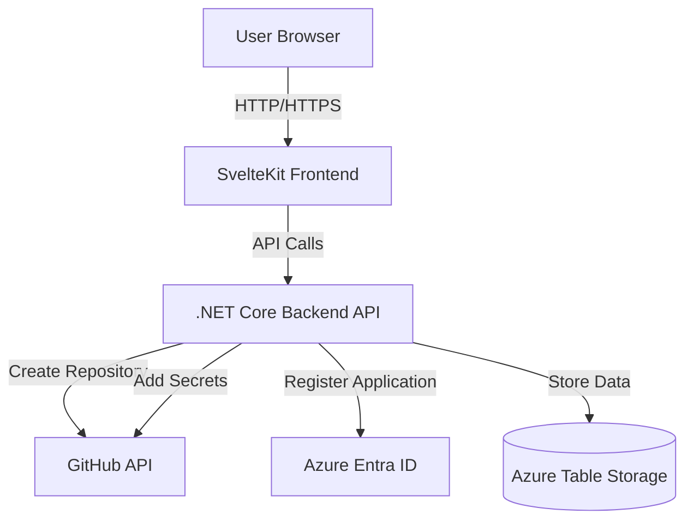
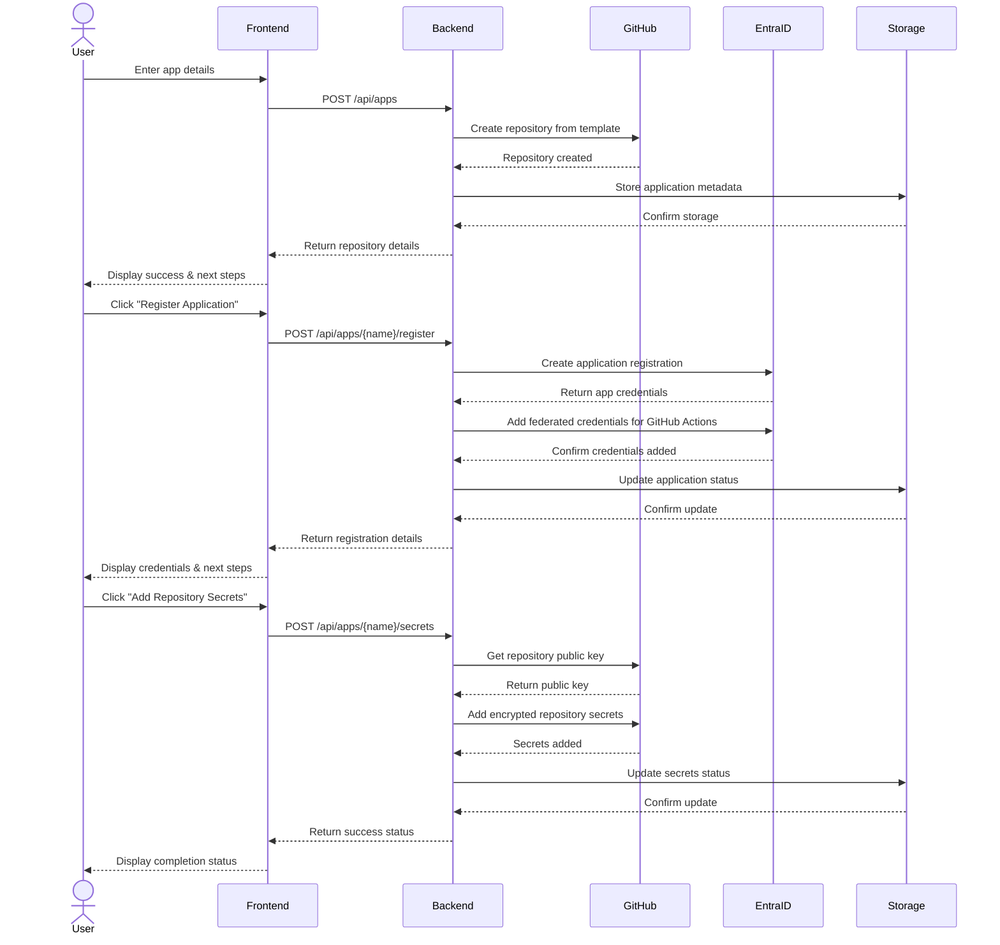
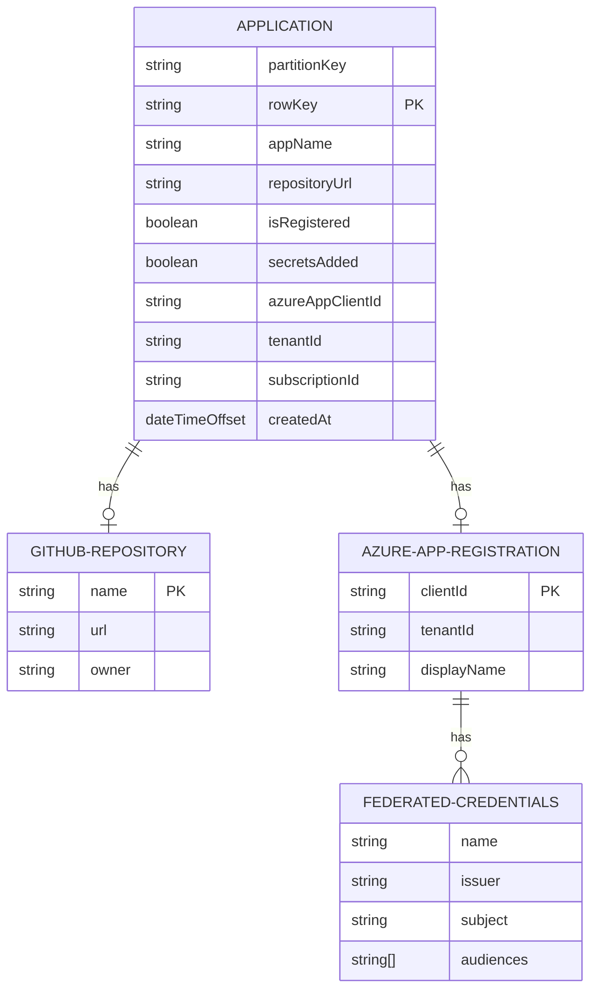
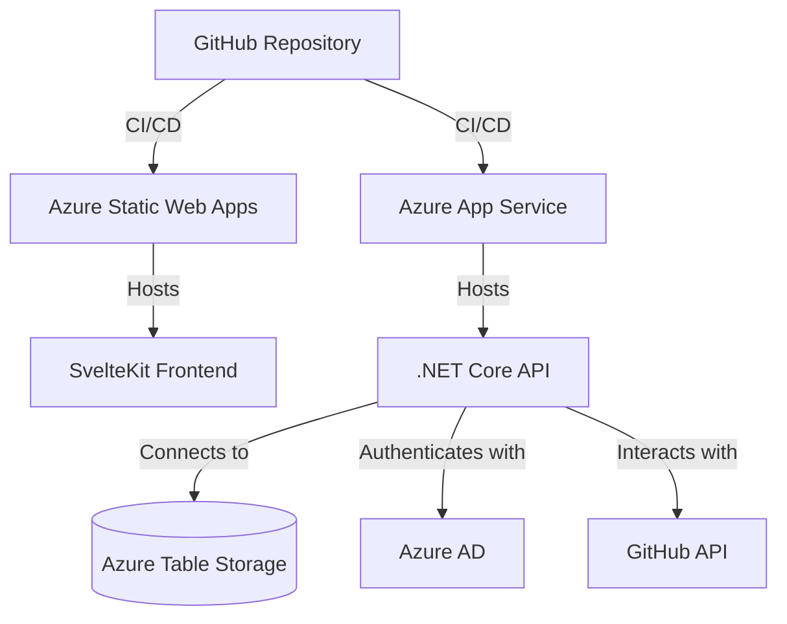
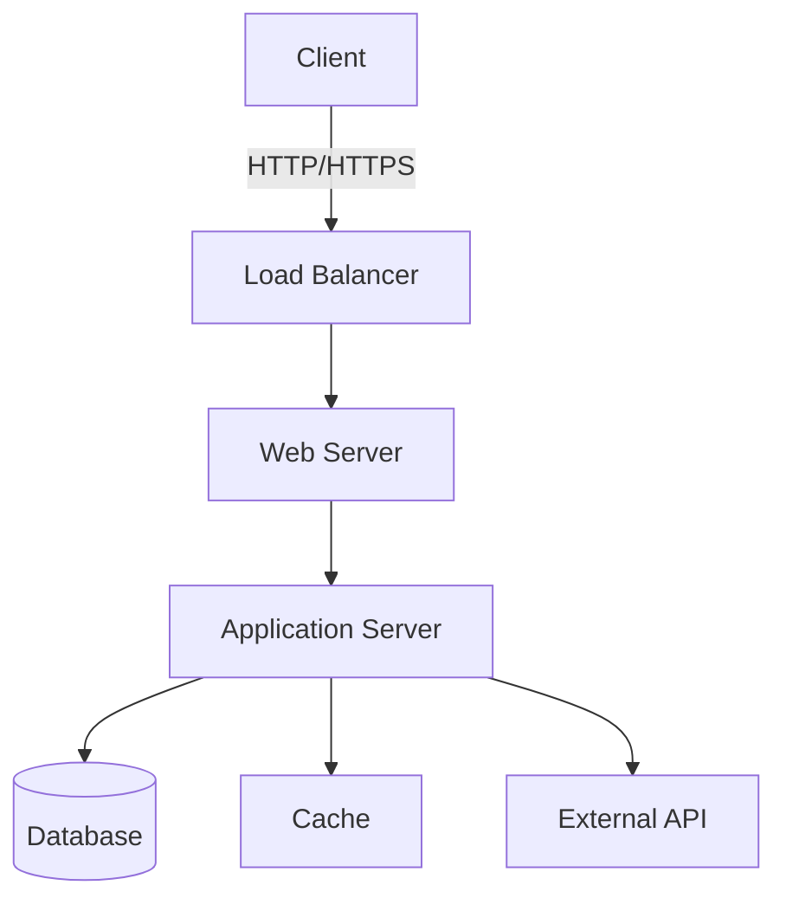
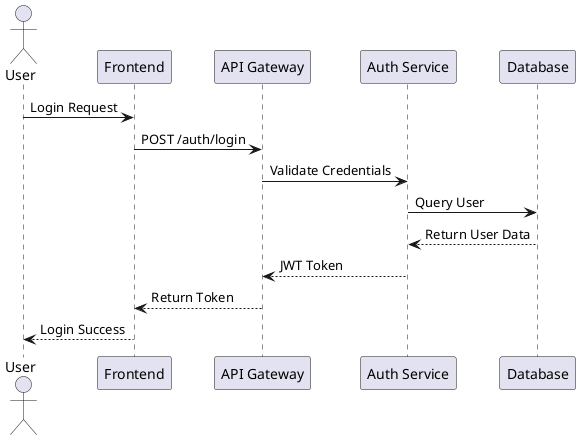

# Architecture Diagrams

## System Architecture Overview

The Minimal-IDP system consists of a SvelteKit frontend application, a .NET Core backend API, and integrations with GitHub and Azure services.

### Component Descriptions

#### Frontend Application

- **SvelteKit Application**: Provides the user interface for managing applications
- **Key Pages**: Dashboard, Application Creation, Application Details
- **Main Features**: Create repositories, register applications, manage secrets
- **Technologies**: SvelteKit, JavaScript/TypeScript, CSS

#### Backend API

- **.NET Core API**: Processes requests and orchestrates operations with external services
- **Key Services**:
  - `ApplicationStorageService`: Manages application data in Azure Table Storage
  - `GitHubService`: Creates repositories and manages repository secrets
  - `AzureAdService`: Creates Entra ID applications and federated credentials
  - `GitHubAppAuthService`: Handles GitHub App authentication
- **Key Endpoints**: `/api/apps` for CRUD operations on applications
- **Technologies**: ASP.NET Core, C#, Azure SDK, Octokit.NET, Microsoft Graph SDK

#### Database

- **Azure Table Storage**: NoSQL table storage for application metadata
- **Schema**: Simple table with application details including GitHub repository URL, registration status, and Azure identifiers
- **Partition Strategy**: All applications stored with partition key "Application" and row key based on application name

#### External Services

- **GitHub**:
  - Hosts application code repositories
  - Provides GitHub Actions for CI/CD
  - Used for secret storage (encrypted repository secrets)
  - Accessed via GitHub App authentication
- **Azure Entra ID**:
  - Manages application identities for Azure resources
  - Provides OIDC federation for GitHub Actions authentication
  - Enables workload identity for secure cloud deployments
- **Azure Table Storage**:
  - Stores application metadata and status
  - Provides persistence for the application lifecycle

## Data Flow Diagrams

### Application Creation Flow

## Entity Relationship Diagram

## Deployment Architecture

The system can be deployed using Azure services for both the frontend and backend components.

## Diagram Creation Guidelines

### Tools for Creating Diagrams

- [Draw.io](https://app.diagrams.net/) (free)
- [Lucidchart](https://www.lucidchart.com/)
- [Mermaid](https://mermaid-js.github.io/mermaid/#/) (for code-based diagrams)
- [PlantUML](https://plantuml.com/)

### Mermaid Example (Component Diagram)

### PlantUML Example (Sequence Diagram)

